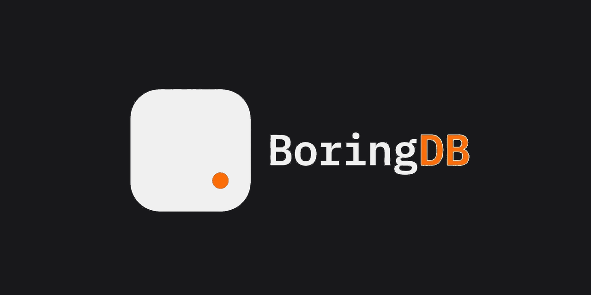

# BoringDB

**Visual database schema designer, running entirely on Cloudflare Workers.**

Design schemas visually, describe them in plain English and let AI generate the structure, then export real DDL for PostgreSQL, MySQL, SQLite, or SQL Server.

[**Live demo**](https://db.getboring.io) &nbsp;|&nbsp; [**Boring-Works/boringdb**](https://github.com/Boring-Works/boringdb)



---

## What it does

- **AI schema generation** — describe a schema in plain English, get a visual diagram back. Powered by Cloudflare Workers AI (no OpenAI key required).
- **Visual editor** — drag-and-drop tables, draw relationships, edit columns inline.
- **Multi-dialect export** — generates real DDL for PostgreSQL, MySQL, SQLite, SQL Server, and MariaDB.
- **Local-first** — all diagrams stored in your browser via IndexedDB. Nothing leaves your machine.
- **Import existing schemas** — paste SQL DDL or DBML and it builds the diagram automatically.

---

## What this fork adds

This is a fork of [ChartDB](https://github.com/chartdb/chartdb) (AGPL-3.0), ported to run entirely on Cloudflare Workers and Workers AI.

Key changes from upstream:

- **Cloudflare Workers deployment** — the entire app including the AI proxy is a single Worker. No separate backend, no Node server, no OpenAI API key.
- **Two specialized Workers AI models** — `qwen2.5-coder-32b-instruct` for schema generation (code-fine-tuned) and `gpt-oss-120b` for general queries.
- **Stream normalization** — Workers AI returns a legacy stream format. `worker.ts` normalizes it to OpenAI-compatible SSE so the Vercel AI SDK works without modification.
- **Format auto-detection** — models often output SQL DDL despite being prompted for DBML. `detectImportMethod()` handles both and routes them through the correct import pipeline automatically.

---

## Stack

| Layer | Tech |
|-------|------|
| Frontend | React 18, TypeScript, Vite, Tailwind CSS |
| Visual editor | React Flow (`@xyflow/react`) |
| Code editor | Monaco Editor |
| Storage | IndexedDB via Dexie (local-first, no backend) |
| AI proxy | Cloudflare Workers + Workers AI |
| Schema parsing | `@dbml/core`, custom SQL dialect importers |
| Deployment | Single Cloudflare Worker serves static app + AI endpoint |

---

## Run locally

```bash
pnpm install

# Terminal 1: Vite dev server
pnpm run dev

# Terminal 2: Workers AI proxy (requires Cloudflare account)
npx wrangler dev
```

App runs at `http://localhost:5173`. AI features require the Worker on `:8787`.

---

## Deploy your own

Requires a Cloudflare account with Workers AI enabled (free tier works).

```bash
pnpm install
pnpm run build
pnpm run deploy
```

Configure a custom domain in the Cloudflare dashboard pointing to your Worker. Do not add `routes` in `wrangler.toml` -- use Custom Domain instead (routes cause 10020 conflicts with the custom domain binding).

---

## Attribution

BoringDB is a fork of [ChartDB](https://github.com/chartdb/chartdb) by the ChartDB contributors, licensed under [AGPL-3.0](LICENSE). See [NOTICE](NOTICE) for the full list of modifications from upstream.
