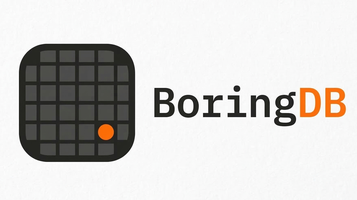

<p align="center">
  
</p>

<p align="center">
  <strong>The database schema designer that just works.</strong>
  <br />
  Describe it. See it. Export it. Done.
</p>

<p align="center">
  <a href="https://db.getboring.io"><strong>Try it now</strong></a>&nbsp;&nbsp;|&nbsp;&nbsp;<a href="#quick-start">Self-host</a>&nbsp;&nbsp;|&nbsp;&nbsp;<a href="#how-it-works">How it works</a>
</p>

<p align="center">
  
  
</p>

---

## Why BoringDB

Most database design tools are either bloated desktop apps, SaaS products that hold your data hostage, or toys that can't export real SQL.

BoringDB is none of those.

- **Runs in your browser.** No install. No account. No data leaves your machine.
- **Describe what you need.** Type "e-commerce with users, products, orders, and reviews" and get a working schema.
- **Handles whatever the model throws.** DBML, SQL, markdown-wrapped code blocks — it auto-detects and parses it all.
- **Exports real DDL.** PostgreSQL, MySQL, SQLite, SQL Server, MariaDB, Oracle. Pick your dialect.
- **Deploys on the edge.** One Cloudflare Worker. Static assets + schema generation. No origin server.

---

## How It Works

```
Describe your database in plain English
              |
              v
   Schema generated on the edge (Workers AI)
              |
              v
   Format auto-detected (DBML or SQL)
              |
              v
   Parsed and rendered as a visual ERD
              |
              v
   Edit tables, relationships, indexes visually
              |
              v
   Export as SQL for your target database
```

**Supported databases:** PostgreSQL, MySQL, SQLite, SQL Server, MariaDB, Oracle, CockroachDB

**Supported import formats:** DBML v2, SQL DDL (all dialects), JSON metadata

---

## Quick Start

### Use it hosted

**[db.getboring.io](https://db.getboring.io)** — nothing to install.

### Self-host

```bash
git clone https://github.com/Boring-Works/boringdb.git
cd boringdb
npm install
npm run dev
```

Schema generation needs the Worker running locally:

```bash
wrangler dev
```

### Deploy your own

```bash
npm run build
wrangler deploy
```

Configure in `public/config.js`:

```javascript
window.env = {
    OPENAI_API_ENDPOINT: '/api/v1',
    AI_DIAGRAM_MODEL: 'qwen2.5-coder-32b-instruct',
    OPENAI_API_KEY: 'proxy',
    DISABLE_ANALYTICS: 'true',
};
```

---

## Stack

| Layer | Tech |
|-------|------|
| Frontend | React, Vite, TypeScript, Tailwind CSS, Monaco Editor |
| Hosting | Cloudflare Workers + Workers AI |
| Storage | Browser IndexedDB via Dexie.js |
| Parsing | @dbml/core (DBML v2), custom SQL dialect importers |
| Schema Gen | Vercel AI SDK, streaming SSE, format auto-detection |

---

## Key Features

### Visual ERD Editor
Drag-and-drop tables. Click to add fields, indexes, and constraints. Draw relationships between tables. Everything updates in real-time.

### Smart Format Detection
The schema generator asks for DBML but models sometimes output SQL. BoringDB detects the format automatically and routes through the correct parser — DBML goes through `@dbml/core`, SQL goes through dialect-specific importers. No manual intervention needed.

### DBML Syntax Fixer
LLMs produce DBML with 15+ categories of syntax issues — uppercase keywords, bare SQL constraints, unquoted defaults, empty type params, inline enums. The `fixDBMLSyntax()` post-processor normalizes all of them before parsing.

### SQL Export
Export your diagram as DDL for any supported database. The exporter handles type mapping, constraint syntax, and dialect-specific features automatically.

---

## Contributing

BoringDB is open source under AGPL-3.0. PRs welcome.

```bash
git clone https://github.com/Boring-Works/boringdb.git
cd boringdb
npm install
npm run dev
```

The codebase uses ESLint + Prettier for linting. Run `npm run lint` before submitting.

---

## License

**AGPL-3.0** — see [LICENSE](LICENSE) and [NOTICE](NOTICE).

BoringDB is a modified version of [ChartDB](https://github.com/chartdb/chartdb) by the ChartDB contributors. All modifications are documented in the [NOTICE](NOTICE) file. Under AGPL-3.0, if you deploy a modified version as a network service, you must make the source code available to your users.

---

<p align="center">
  Built by <a href="https://getboring.io">Boring Works</a> in Johnson City, TN.
</p>
